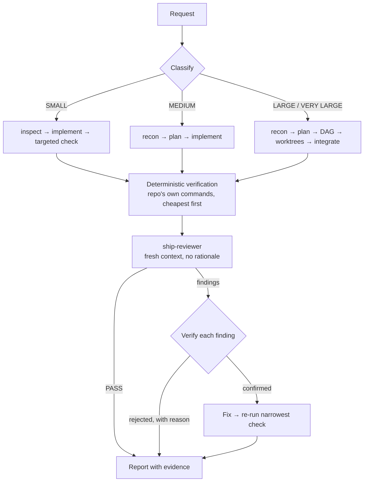

# ship: a senior-engineer workflow for Claude Code

> **ship turns an ordinary engineering request into a verified, independently reviewed change — without you orchestrating a single agent.**

[](LICENSE)
[](https://docs.claude.com/en/docs/claude-code/skills)
[](#repository-layout)
[](#project-status)

You say *"add refresh-token rotation."* ship classifies the task, recons only the code that
matters, plans when a plan earns its keep, implements, runs the repo's **own** test commands,
sends the diff to a reviewer that never saw its reasoning, verifies each finding before
fixing it, re-checks, and reports with evidence.

No YAML contracts to write. No agents to pick. No "please run the tests" for the third time.

**Why ship?**
- **Independent review by construction** — the reviewer gets the diff and the acceptance criteria, deliberately *not* the implementer's rationale. An agent that reads its own justification agrees with it.
- **Evidence, not assertion** — a test is never reported as passing unless it ran and passed. Unverified is stated as unverified.
- **Orchestration proportional to the task** — a typo fix spawns nothing. Eighteen independent adapters get worktrees. The decision is written down, not vibes.

[Quickstart](#quickstart) · [How it works](#how-it-works) · [When not to use it](#when-to-use-ship) · [Design principles](#design-principles)

---

## Why this exists

Agentic coding fails in two opposite directions, and most tooling only fixes one.

**Under-engineering:** the agent writes plausible code, declares victory, and never runs
anything. You find out in CI, or in production.

**Over-engineering:** the agent spawns six subagents to rename a variable, each
re-discovering the same architecture, each burning context, and the "review" is the same
model congratulating itself in a fresh window.

```
Typical agent loop              ship

request                         request
   ↓                               ↓
edit files                      classify size ─────► SMALL: inspect → edit → check → done
   ↓                               ↓
"Done! ✅"                      recon (targeted) → plan (if it earns one)
                                   ↓
                                implement → run the repo's real commands
                                   ↓
                                independent review (fresh context, no rationale)
                                   ↓
                                verify each finding → fix confirmed only → re-check
                                   ↓
                                report: what changed, what ran, what's unverified
```

The insight is that **the orchestration should scale with the task, and the reviewer must be
structurally unable to inherit the implementer's confidence.** Everything else follows.

---

## Proof

ship is a prompt-layer skill, so the honest evidence is structural, not a latency benchmark.
Every number below is reproducible from the repo in one command.

| Metric | Value | How to reproduce |
|---|---:|---|
| Loaded on every trigger (`SKILL.md`) | **13.9 KB** | `wc -c .claude/skills/ship/SKILL.md` |
| Loaded **only when a phase needs it** (5 references) | **26.5 KB** | `wc -c .claude/skills/ship/references/*.md` |
| Deferred share of skill text | **66%** | ratio of the two above |
| Reviewer / verifier context | **separate** | own agent, own window — never inherits the transcript |
| Runtime dependencies | **0** | no scripts, no install, no language assumptions |
| Frontmatter validation | **passes** | `python skill-creator/scripts/quick_validate.py .claude/skills/ship` |

A SMALL task — a typo, a one-file fix — costs `SKILL.md` and nothing else. The parallelism
rules, the worktree procedure, and the review contract stay on disk until a task actually
reaches those phases. That is what progressive disclosure buys, and it is why the skill can
afford to be opinionated in depth without taxing every trivial request.

**What is *not* proven yet:** no head-to-head defect-detection benchmark against a bare
agent, no token-usage measurement across a task corpus. The eval suite that would measure
the first of those now exists in [`evals/`](evals/) — ten cases, each run with and without
the plugin so the headline number is uplift — but it has not been run yet: `claude plugin
eval` is in early access. See [Project status](#project-status). Claims in this README are
limited to what the files themselves demonstrate.

---

## Quickstart

Two files' worth of copying, no install step, no dependencies.

```bash
git clone https://github.com/aafre/ship.git
mkdir -p your-project/.claude/skills your-project/.claude/agents
cp -r ship/.claude/skills/ship   your-project/.claude/skills/
cp    ship/.claude/agents/ship-*.md  your-project/.claude/agents/
```

For every project instead of one, create `~/.claude/skills/` and `~/.claude/agents/` first,
then use those directories as the copy destinations.

Then, in Claude Code:

```
/ship Add cursor pagination to the users API
```

Or just ask normally — the skill triggers on substantive change requests on its own:

```
Fix the race condition in the ingestion worker
```

For MEDIUM/LARGE work, once a plan is approved, the skill routes the mechanical parts
(rendering `tasks.json`, running the worker graph, checking progress) through the local CLI
in [`packages/cli`](packages/cli) when it's built — `ship plan`, `ship run <run-dir>
tasks.json`, `ship status <run-dir>` — instead of hand-rolling worktrees and state tracking in
the conversation. If it isn't built, the skill falls back to doing all of that by hand; you
never have to choose one path yourself.

Expected shape of what comes back:

```
Added cursor pagination to GET /users, following the shape already used by
/orders (src/api/users.py:88, src/api/pagination.py reused unchanged).
Callers that pass no cursor get the previous behaviour.

Checks: pytest -q tests/api/test_users.py → 14 passed
        ruff check src/ → clean
        mypy src/api → clean
Review: ship-reviewer returned 1 finding (P2, missing test for limit=0);
        confirmed and fixed, test added.
Unverified: integration suite not run (needs a live DB).
```

---

## What it does

**Sizes the task before touching it.** SMALL / MEDIUM / LARGE / VERY LARGE, judged by the
diff it expects rather than the sentence it was given. The class picks the workflow. When
it's a close call, it runs the *smaller* workflow and escalates if recon proves it wrong —
escalation is cheap, over-orchestration isn't.

**Recons by search, not by reading.** Greps the symbol, follows call sites, opens the nearest
tests, and finds the analogous implementation already in the tree. That analogue is the
highest-value artifact of recon: it hands over the conventions, the test style, and the
abstractions to reuse, which is how the diff ends up looking like the rest of the codebase.

**Runs the repository's own commands.** Discovers them from `AGENTS.md`, package scripts,
`Makefile`/`justfile`/`Taskfile`, or CI config — before inventing any. It will not run
`pytest` because a file ends in `.py` when the repo drives tests through `make test`. Checks
run cheapest-first and stop at the first failure.

**Reviews with a reviewer that can't cheat.** `ship-reviewer` receives objective, acceptance
criteria, constraints, out-of-scope, the diff, and the test results. It does not receive the
implementer's reasoning. It returns P0–P3 findings with evidence and a reproduction step, or
`PASS` — and `PASS` is documented as a good outcome, so it isn't pressured to manufacture
findings.

**Treats findings as hypotheses.** Each material finding is reproduced or logically confirmed
before anything is changed. Findings that contradict the acceptance criteria, contradict the
repo's architecture, demand out-of-scope work, or rest on a misreading get rejected with a
one-line reason. Blindly applying reviewer suggestions is how a working change becomes a
broken one.

**Verifies behaviour when reading isn't enough.** `ship-verifier` runs the real commands or
drives the actual UI in a browser, and reports what it observed. It is explicitly forbidden
from modifying source — it verifies, it doesn't fix.

**Parallelizes only when parallelism is real.** Five conditions must all hold before a second
implementation agent exists. Otherwise: sequential, which is usually right.

---

## How it works



Three subagents, used conditionally — never by default:

| Agent | Used when | Gets | Returns |
|---|---|---|---|
| **Explore** (built-in) | the answer needs a wide fan-out and you want the conclusion, not the files | one narrow bounded question | paths, patterns, constraints, tests, risks, unknowns |
| **ship-reviewer** | any non-trivial change; always for auth/money/migrations/concurrency regardless of size | criteria + diff + test results | P0–P3 findings with evidence, or `PASS` |
| **ship-verifier** | "it reads correctly" isn't sufficient evidence — UI and end-to-end paths | criteria + how to run | observed behaviour, per criterion |

Specialist review is routed by **what the diff touches**, not by task size. Security review
when it touches auth, secrets, crypto, query construction, shell execution, deserialization,
file paths, or permissions. Performance review when it touches hot paths, query loops,
streaming, caching, or concurrency. One specialist when warranted — not three on every diff.

---

## Real-world example

**Goal:** *"Migrate the 18 provider adapters from interface V1 to V2."*

This is the case where naive agent tooling fans out eighteen ways and returns eighteen
different interpretations of V2. ship's parallelism rules handle it in order:

1. **Classify** → VERY LARGE. Mechanical, many isolated units.
2. **Freeze the interface first.** The V2 definition is settled in one place, by one agent,
   before anything is parallelized. An interface that is still moving cannot be built against.
3. **Migrate adapter #1 yourself.** That first unit is the template — it proves the migration
   works, surfaces the surprises, and becomes the worked example every worker receives.
   Fanning out before doing one is how you get N different wrong answers.
4. **Build the DAG.** `A: freeze + reference adapter` → `B,C,D: adapters 2–18 in three
   groups` → `E: remove the V1 shim`. Only nodes whose dependencies are complete execute.
5. **Fan out into isolated worktrees**, one compact Work Contract each: objective, its slice
   of the acceptance criteria, the files it owns, what's already settled (*don't redo, don't
   change*), the commands to run, the output shape required. No conversation transcript, no
   re-exploring the repo.
6. **Integrate deliberately** — merge in dependency order, run affected tests after *each*
   merge, not just the last. The bug you're hunting is the one caused by combining two
   individually-correct changes.
7. **Review the integrated diff**, not the individual worker diffs. Seams are where the
   defects live.

The inverse case is written down just as explicitly. *"Refactor the core transaction model
used throughout the system"* is listed in `references/parallelism.md` under **when fan-out
clearly does not apply** — everything depends on the same shape, so architecture is settled
first and the core change lands before any mechanical call-site work is distributed.

---

## When to use ship

**Use it for:** features, bug fixes, refactors, migrations, performance work, API and schema
changes, test work, reliability fixes, security-sensitive changes, "implement this issue."

**It deliberately does not trigger on:** questions about code, explanations, brainstorming,
code reading with no modification, or one-line edits where the workflow costs more than it
returns. If it fires on something trivial anyway, the SMALL path collapses to
inspect → edit → check, which is what you'd have done by hand.

**It does not replace:**
- a test framework — it runs *yours*
- TDD discipline, if that's your practice (it updates tests alongside behaviour; it does not enforce test-first)
- CI — it's a local workflow, not a pipeline
- code review by humans, on changes where humans should look
- linters, type checkers, or security scanners — it invokes them, it isn't one

---

## Design principles

**Evidence over assertion.** Never claim a test passed unless it ran and passed in-session.
"I didn't run the integration suite" is a fine thing to say; implying you did is not. Anything
unverified is named as unverified in the final report.

**The reviewer must not inherit the implementer's confidence.** Independence is structural,
not aspirational — it comes from withholding the rationale, not from asking nicely for
scepticism.

**Orchestration proportional to the task.** Agents are used where independence, context
isolation, specialization, or genuine concurrency creates measurable value. Everywhere else
they are cost. Multi-agent theatre is worse than a single competent agent.

**Context is the budget.** Paths not contents, summaries not transcripts, diffs not files,
filtered output not raw logs. One agent maps an area and the others are told what it found.

**Repository state is the source of truth.** The workflow restarts from git, not from a
conversation. LARGE work persists its contract and plan so a fresh agent resumes from durable
artifacts.

**The smallest correct change.** YAGNI, KISS, DRY and SOLID applied pragmatically. No
abstraction for a hypothetical second caller. No drive-by refactors. If the plan is longer
than the diff it describes, the plan is wrong.

---

## Trade-offs

Stated plainly, because a workflow that only lists its strengths isn't one you can plan around.

**It is slower than a bare agent on medium tasks.** Recon, review, and finding-verification
cost wall-clock time. The trade is fewer defects reaching you. On genuinely small changes the
skill collapses to near-zero overhead precisely because that trade stops being worth it.

**Review quality is bounded by the diff's legibility.** A reviewer given only the diff and
the criteria catches contract violations, edge cases, and missed call sites well. It catches
"this contradicts an undocumented decision made three sprints ago" poorly. That's a real
limit of context isolation, and it's the price of independence.

**Classification is a judgement call, not a computation.** It can be wrong. The mitigation is
directional: when torn, run the smaller workflow and escalate. Under-orchestrating recovers
cheaply; over-orchestrating burns context you can't get back.

**No enforcement.** This is a prompt-layer skill. It shapes behaviour strongly, but nothing
here is a hard gate — unlike a CI check, which is why it should sit alongside CI and not
instead of it.

**No empirical benchmark yet.** The structural claims in [Proof](#proof) are reproducible.
The behavioural ones — fewer defects, less context — are design intent, honestly labelled as
such until an eval harness measures them.

---

## Security and privacy

- **Nothing leaves your machine.** The skill is Markdown. There is no telemetry, no network
  call, no phone-home. Whatever your Claude Code installation already sends is unchanged by
  installing this.
- **No executable payload in the skill itself.** No scripts, no post-install hooks, no
  dependencies to audit — `.claude/` is nine Markdown files, generated from `skills/ship/`
  (see [Repository layout](#repository-layout)), and short enough to read end to end. The
  optional `packages/cli/` companion (v0.2, in progress) is real TypeScript with no runtime
  dependencies of its own — audit it the way you'd audit any small Node CLI.
- **`ship-reviewer` is instructed not to modify files**, and is scoped to `Read, Grep, Glob,
  Bash`; this is an instruction, not a filesystem guarantee, because Bash can write files.
- **`ship-verifier` is instructed not to modify source**, and is scoped to verification and
  browser tools. Note this one is an instruction, not a tool-level guarantee: it holds `Bash`,
  which it needs to run your test commands.
- **Security review is routed automatically** when a diff touches auth, authorization,
  secrets, crypto, user-controlled file handling, query construction, shell or process
  execution, deserialization, network boundaries, or permissions.
- **No compliance claims.** No SOC 2, no certification, no audit. It's a workflow skill.

---

## Repository layout

```
skills/ship/                  canonical source — edit here, never under .claude/ directly
├── SKILL.md                  core workflow + task classification (always loaded on trigger)
├── README.md                 skill-local docs
├── agents/
│   ├── ship-reviewer.md      independent fresh-context reviewer (read-only tools)
│   └── ship-verifier.md      behavioural verifier (repo commands + browser)
└── references/                progressive disclosure — loaded per phase, not up front
    ├── task-contract.md        contract fields, inference rules, persistence, resuming
    ├── review-contract.md      reviewer briefing, P0–P3 ladder, triage, specialist routing
    ├── verifier-contract.md    capability-aware verification model, evidence, failure classes
    ├── workflow-rules.md       implementation, verification, completion, and coding-contract detail
    └── parallelism.md          the fan-out test, DAG, work contracts, worktrees, integration

.claude/                      generated copy — `cd packages/cli && npm run build:integrations`
├── skills/ship/               regenerates this from skills/ship/; check:drift catches hand-edits
└── agents/
.claude-plugin/
└── plugin.json                also generated; makes the repo installable and eval-resolvable

packages/cli/                 v0.2, in progress: TypeScript CLI (`ship plan|run|status`), no
                               runtime dependencies. Adapters for Claude/Codex, git worktree +
                               integrate-branch delivery, capability-aware verification. See
                               docs/ship-v0.2/plan.md. SKILL.md routes through it when built,
                               falls back to the v0.1 prompt-only path otherwise.

evals/                        10 behavioural cases + validate.py — see evals/README.md
```

---

## Comparison

An honest one. ship loses rows.

| | ship | Bare Claude Code | TDD-first skill suites | Hand-rolled multi-agent |
|---|:---:|:---:|:---:|:---:|
| Adapts orchestration to task size | ✅ | ➖ implicit | ➖ | ❌ usually fixed |
| Independent review without the author's rationale | ✅ | ❌ | ➖ varies | ➖ varies |
| Reviewer findings verified before being applied | ✅ | ❌ | ❌ | ❌ |
| Uses the repo's own test commands, not assumed ones | ✅ | ➖ often assumed | ✅ | ➖ |
| Enforces test-first discipline | ❌ | ❌ | ✅ | ❌ |
| Deterministic gate (blocks on failure) | ❌ prompt-layer | ❌ | ❌ | ❌ |
| Empirical benchmark published | ❌ not yet | — | ➖ some | ❌ |
| Setup cost | copy 7 files | none | varies | high |
| Works across languages without configuration | ✅ | ✅ | ➖ | ➖ |

If you want test-first enforced, pair ship with a TDD skill — ship governs *how the work is
orchestrated and verified*, not whether you write the test first. If you want a hard gate,
that's CI's job, and ship is designed to arrive at CI with the checks already green.

---

## Project status

**v0.1 — early, usable, unbenchmarked.**

| | |
|---|---|
| Core workflow (classify → recon → implement → verify → review → triage → report) | stable |
| `ship-reviewer`, `ship-verifier` | stable |
| Progressive disclosure across 5 references | stable |
| Parallelism / worktree guidance | written, lightly exercised |
| Eval suite ([`evals/`](evals/), 10 cases, with/without ablation) | **written, not yet run** — blocked on `claude plugin eval` early access |
| Published benchmark numbers | **not built** |
| Design-scenario coverage | walked through 7 scenarios (trivial fix, feature, security-sensitive change, parallelizable migration, non-parallelizable refactor, reviewer false positive, context pressure) — a design review, not an empirical result |
| `packages/cli/` (v0.2) | unit/fixture-tested; **one recorded live run, Claude host/Claude worker, single small task** — see [`docs/ship-v0.2/smoke-log.md`](docs/ship-v0.2/smoke-log.md). That run took four attempts, each surfacing and fixing a real bug fixture tests couldn't reach (a Windows spawn failure, stale git worktree state, a silently false "integrated" claim, and uncommitted-but-correct work). Codex-worker and multi-task/manual-task runs are **not yet run**. |

**Roadmap, in order of usefulness:**
1. Live smoke coverage for the Codex adapter and a multi-task/manual-task run — the Claude/single-small-task path is now proven; the rest of the matrix isn't.
2. Pilot and calibrate the suite in [`evals/`](evals/), so the behavioural claims become measured claims.
3. Defect-detection comparison against a bare agent on a seeded-bug corpus.
4. Token-usage measurement per task class.
5. A worked LARGE example in a real multi-package repo.

Issues and counter-examples are more valuable than stars right now — particularly cases where
it over-orchestrates a small task or under-verifies a risky one.

---

## Contributing

`skills/ship/` is the canonical source; `.claude/skills/ship/` and `.claude/agents/` are
generated copies checked into the repo so Quickstart still needs no build step.

```bash
git clone https://github.com/aafre/ship.git
# edit skills/ship/SKILL.md or skills/ship/references/ (never .claude/skills/ directly)
cd packages/cli && npm run build:integrations   # regenerates .claude/skills, .claude/agents, plugin.json
npm run check:drift                              # fails if a generated copy was hand-edited instead
python path/to/skill-creator/scripts/quick_validate.py .claude/skills/ship
```

Guidelines that keep it coherent:
- **`SKILL.md` stays under ~250 lines.** Detail belongs in `references/`, loaded per phase.
- **New rules need a failure they prevent.** A rule that doesn't change an outcome is context tax.
- **Don't add a reference file for a paragraph.** Four is close to the right number.
- **No fabricated evidence.** Numbers in the README must be reproducible with a stated command.

## License

MIT — see [LICENSE](LICENSE).
