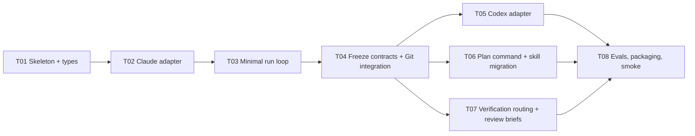

# Ship v0.2 launch tasks

Date: 2026-09-11  
Status: Ready for implementation review; no tasks launched. Rewritten after scope cut on 2026-09-11.  
Source of truth: [Implementation plan](plan.md)

This is the work order for building Ship v0.2. The future `ship run` does not exist yet; these tasks are executed with the current v0.1 prompt skill and the host's native agent launching. Begin only after the user authorizes implementation in an execution-capable session.

## 1. Sequencing: vertical slice first

The previous draft froze seven contracts in T01 and fanned six tasks out on them before any adapter or scheduler existed. This draft builds one thin end-to-end path first, freezes contracts after it works, then fans out.

T01–T04 are sequential and each small enough for one worker. T05/T06/T07 are independent after T04 and may run in parallel (three workers, under the four-worker ceiling). T08 closes.

## 2. Handoff rules

The implementing orchestrator reads this document, the plan, and applicable repo instructions; inspects Git state; and preserves existing user changes (including untracked `REVIEW.md` and `docs/ship-portability-assessment.md`). It does not rely on the planning conversation.

Baseline: a prompt-only Claude plugin (`.claude/skills/ship`, `.claude/agents/ship-{reviewer,verifier}.md`, `.claude-plugin/plugin.json`) with seven offline eval cases; `python evals/validate.py` passes. No CI. Node 24.19 installed.

Each worker receives: task ID, objective, owned paths, dependencies, applicable repo guidance, the coding contract (plan §3), and expected checks. Workers do not broaden ownership or change a shared interface silently; they request the change from the owner via the orchestrator. Workers return: task/attempt ID, changed paths and commit, commands actually run with outcomes, evidence paths, unresolved blockers.

Reviewers get criteria, diff, and check evidence — not the implementation transcript. Verifiers do not repair source.

## 3. Ownership map

| Task | Depends on | Owns |
| --- | --- | --- |
| T01 | — | `packages/cli/` skeleton, `package.json`, `tsconfig.json`, `src/types.ts`, `src/state.ts` |
| T02 | T01 | `packages/cli/src/adapters/claude.ts` + fixtures |
| T03 | T02 | `packages/cli/src/run.ts`, `src/scheduler.ts`, `src/cli.ts` (`run`, `status`) |
| T04 | T03 | contract freeze in `src/types.ts`, `src/git.ts` + temp-repo fixtures |
| T05 | T04 | `packages/cli/src/adapters/codex.ts` + fixtures |
| T06 | T04 | `skills/ship/` (sole owner of `SKILL.md` and `references/`), `src/plan.ts`, `src/discover.ts`, `src/config.ts`, `integrations/claude/` generator |
| T07 | T04 | `src/verify.ts`, `src/capabilities.ts`, `skills/ship/references/{review-contract,verifier-contract}.md` (content handed to T06 to place) |
| T08 | T05, T06, T07 | `evals/`, root `README.md`, drift check, smoke records |

Shared manifests (`package.json`, `tsconfig.json`) have one owner at a time: T01 until T04, T04 until T08. After T04, `src/types.ts` changes need T04-owner sign-off through the orchestrator.

## 4. Task contracts

### T01 — Skeleton and types

**Objective:** The smallest compiling CLI with the state primitive everything else needs.

**Work:** `packages/cli/` with `package.json` (no runtime deps; `typescript` dev-only), `tsconfig.json`, `npm run build`, `npm test` = `node --test`. `src/types.ts`: draft `Task`, `TaskGraph`, `RunState`, `Profile`, `Capabilities`, `WorkerResult`, each with a `version` field. Draft means: expected to change through T03; not frozen. `src/state.ts`: `readState`, `writeState` (temp-then-rename), `acquireLock`/`releaseLock` (lock file in the run dir), `validateGraph` (acyclic, deps exist, no ownership overlap among tasks that could run concurrently).

**Checks:** `node --test` covering: write is atomic on crash simulation (write to temp, rename missing → old state intact); second lock acquire fails; graph validator rejects cycle, missing dep, overlapping ownership; malformed/wrong-version state rejected before any side effect.

**Done:** `npm run build && npm test` green. No I/O beyond the run dir.

### T02 — Claude adapter

**Objective:** Launch, observe, and cancel a Claude worker through `claude -p`.

**Work:** Implement the adapter interface from plan §6 for Claude: spawn with argument arrays (`--output-format stream-json`, explicit `--model`, explicit session ID for continuation), normalize the stream to `Event`s, extract the final structured result, propagate nonzero exit and missing executable as failures, kill the process tree on cancel. `probe()` launches a trivial headless session and records tool availability as `available | unavailable | unknown` with the raw evidence. Verify exact flags against the installed `claude` first and record the version.

**Checks:** Fixtures for a representative stream, truncated stream, malformed line, nonzero exit, missing executable, cancellation mid-stream, a cwd with spaces on Windows. One recorded live smoke: a worker that creates one file and returns a structured result, in a temp repo, with the transcript saved as evidence.

**Done:** Fixtures green; live smoke recorded separately from fixtures; a failed launch cannot surface as a successful result.

### T03 — Minimal run loop

**Objective:** `ship run` executes a hand-written `tasks.json` end to end with Claude workers and survives Ctrl-C.

**Work:** `src/scheduler.ts`: ready-task selection (deps `integrated`, ownership compatible, slot free), 4 implementation + 2 review/verify slots. `src/run.ts`: fresh orchestrator per cycle with a briefing built from `state.json` (≤ ~20k tokens estimated; pointers to evidence, never inlined logs); dispatch; accept results only if run/task/attempt match; state transitions `pending → ready → running → implemented → verified → integrated | blocked | failed | cancelled`; process exit moves to `implemented` at most. SIGINT/Ctrl-C: stop workers, write state, exit. `run` on an existing run reconciles state against live PIDs before dispatching. `src/cli.ts`: `run`, `status`. Git integration is **not** in this task — tasks work in the current tree and `integrated` is set by the review/verify slot passing. Mark that with a `ponytail:` comment naming T04 as the upgrade.

**Checks:** Fixture with a fake adapter: three tasks (A→C, B→C) dispatch A and B together, C only after both `integrated`; wrong-attempt result rejected; process success does not release dependents; Ctrl-C then `run` resumes without relaunching a finished task; a task returning a question moves to `blocked` and `status` prints it. One live smoke: two independent doc-edit tasks in a temp repo, real Claude workers.

**Done:** The slice works on the developer's machine with real workers. Whatever the types had to become to get here is now the input to T04.

### T04 — Freeze contracts and add Git integration

**Objective:** Stabilize `types.ts` from what T01–T03 actually needed, then put tasks in worktrees and merge in dependency order.

**Work:** Review every type touched during T02/T03; remove fields nothing reads; bump versions; document the contract in `types.ts` comments (not a separate doc). `src/git.ts`: record base commit; create `ship/<run-id>/integrate` and `ship/<run-id>/<task-id>` with `git worktree add`; dependents branch from the integrate head; before merging a task, merge-test against current integrate head and rerun affected checks; merge one at a time; keep failed/dirty worktrees; remove only clean, stopped, run-owned ones; never touch the user's working tree. Single small task: one branch, no integrate branch. Optional final `gh pr create` to the repo's actual default branch (query it, do not assume `main`). Ship never merges the final PR.

**Checks:** Temp-repo fixtures: siblings merge cleanly; dependent starts from the integrate head containing its prerequisite; merge conflict → task `blocked`, integrate head untouched; dirty user file survives; interrupted merge is detected on resume and not repeated; dirty worktree not removed; fake `gh` for missing auth and for reading the default branch. `run` fixtures from T03 still pass with Git enabled.

**Done:** `types.ts` frozen (later changes go through the orchestrator). Integration is verified against combined code, not task branches alone.

### T05 — Codex adapter

**Objective:** Same adapter contract as T02, for `codex exec --json`.

**Work:** Normalize JSONL events and final result; explicit model and session ID; cancellation; sandbox/permission failures surfaced as failures; `probe()` per T02. Do not infer live context from cumulative token totals. Verify flags against the installed `codex` and record the version.

**Checks:** Fixtures mirroring T02 (representative stream, truncated, malformed, nonzero exit, missing executable, cancel, Windows paths). Live smoke: same one-file task as T02, plus one run of the T03 two-task scenario with Codex workers under the Claude host.

**Done:** Codex passes the adapter fixture suite shared with Claude; unsupported telemetry is `unknown`, never fabricated.

### T06 — Plan command and skill migration

**Objective:** `ship plan` produces the artifacts, and the canonical skill moves to `skills/ship/`.

**Work:**

- Move `.claude/skills/ship/*` to `skills/ship/`. Extend `references/workflow-rules.md` with the coding contract (plan §3) — one copy. Extract client-neutral reviewer/verifier role briefs into `references/` (T07 supplies content; T06 places it). `integrations/claude/` generator produces `.claude/skills`, `.claude/agents`, and `plugin.json`; `npm run check:drift` compares.
- `src/discover.ts`: host, `claude`/`codex`/`gh`/`git` presence and versions, worktree state, test/build commands, `AGENTS.md`/`CLAUDE.md`. `src/config.ts`: user dir + `.ship/config.json`, precedence per plan §2, effective-settings snapshot into the run, no credentials.
- `src/plan.ts`: small-task path (no artifacts); medium/large path producing `plan.md`, `launch-tasks.md`, `tasks.json`, Mermaid from the graph; runs `validateGraph`; records the plan revision hash that `run` will bind approval to. Manual tasks are first-class `type: manual`.
- Update `SKILL.md` so `/ship` on Claude routes through `ship plan` / `ship run` when the CLI is installed and falls back to the v0.1 prompt path when it is not.

**Checks:** Fresh discovery in a temp repo; saved preference reuse and override; missing model rejected without substitution; conflicting guidance surfaced not flattened; planning-only request produces artifacts and no run; cyclic graph rejected; diagram nodes equal `tasks.json` nodes; `run` on a modified plan refuses until re-approved; `check:drift` fails on a hand edit to the generated copy. `python evals/validate.py` still passes.

**Done:** A user can read goal, tasks, diagram, and feasibility before `run`. One skill source; generated copies verified.

### T07 — Verification routing and review briefs

**Objective:** Every required check is assigned to a capable runner or visibly blocked.

**Work:** `src/capabilities.ts`: match a check's required capabilities against probed profiles; readiness preflight in the launched context (port free, URL reachable, binary present); allocate ports/profiles per parallel check; serialize shared resources. `src/verify.ts`: check types (unit/static, integration, scripted browser, interactive/visual, manual); evidence record (command, cwd, commit, exit status, log/screenshot paths); failure classes (assertion, environment, missing capability, unexecuted); two-retry policy for identified transient infrastructure failures only, original failure preserved. Reviewer brief: objective, criteria, constraints, diff, check evidence — no transcript. Verifier brief: exercise and report; never edit source.

**Checks:** Parent-has-browser/child-does-not → `unknown` then blocked; missing browser binary; app fails to start; unreachable URL; port collision serialized; no capable verifier → task stays `implemented`, dependents wait; unchanged assertion failure not retried; unit-test evidence cannot satisfy a browser criterion.

**Done:** No check is marked passed without evidence naming what ran on which commit; verification-pending never releases dependents.

### T08 — Evals, packaging, smoke record

**Objective:** Evidence the slice works and the package installs, without overstating compatibility.

**Work:** Migrate `evals/`: small-task case requires one worker/no fanout using managed execution evidence; keep repo-command, honesty, risky-review, ordering, and discussion-only cases; add coding-ladder cases (existing helper, stdlib solution, no-code-needed, shared root cause across callers, runnable check left behind). Exercise end to end: a small fix, a medium feature (3–4 tasks with one dependency), a whole-goal run with one manual task. Record smoke results for Claude-host/Claude-worker and Claude-host/Codex-worker; label anything not run as not run. Verify plugin install from `integrations/claude/` exposes `/ship`. Update root `README.md`. Independent review of the combined implementation, then fix confirmed findings and re-verify.

**Checks:** `npm run build && npm test && npm run check:drift`; `python evals/validate.py`; the three end-to-end runs with saved evidence; final review PASS or resolved findings.

**Done:** Documentation matches tested compatibility exactly. Release publication is not authorized by this work order.

## 5. Completion and escalation

- Worker output is not completion. Verify changes, checks, review, and integration before releasing dependents.
- Evidence is scoped to the commit it tested; fixes need new evidence.
- Two retries max for transient infrastructure failures; unchanged assertions are never rerun to green.
- Ownership or interface changes go through the orchestrator; material changes to goal, criteria, dependencies, verification, roles, or authority invalidate approval.
- No capable verifier means `implemented`, not done. A fallback must be permitted and named.
- Before final delivery: combined checks, independent review, honest report of what ran, what did not, and the branch/PR state. The final merge is the user's.

## 6. Definition of done

Ship v0.2 is done when a Claude host can `plan` a medium goal, the user can `run` it, Claude and Codex workers execute tasks in isolated worktrees, results are independently reviewed and verified by capability, verified tasks merge in dependency order into an integrate branch, Ctrl-C and `run` resume without duplication, the final merge stays with the user, and every claim in the README has recorded evidence. Everything in plan §8 is explicitly not part of this.
