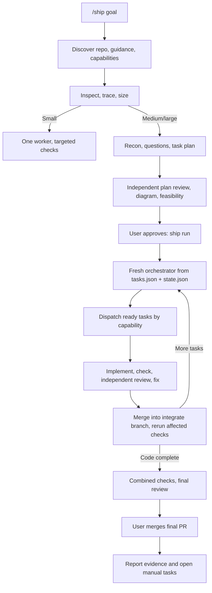

# Ship v0.2: a small CLI that runs an approved plan

Date: 2026-09-11  
Status: Design agreed; scope cut after review on 2026-09-11. Implementation not started. Saving this document does not authorize implementation, agent launches, publishing, or deployment.  
Companion: [Launch tasks](launch-tasks.md)

## 1. Outcome

Turn Ship from a Claude-only prompt workflow into one shared skill plus a small local CLI. The skill still does the thinking: understand the goal, ask the consequential questions, produce a plan. The CLI does the repeatable, unforgiving parts a prompt cannot: launch worker sessions, keep durable run state, integrate task branches in dependency order, and survive the terminal being closed.

The headline experience: `/ship <goal>` inspects the repo, sizes the work, and for anything non-trivial produces `plan.md`, `launch-tasks.md`, `tasks.json`, and a dependency diagram from one task graph. The user approves. `ship run` starts a fresh orchestrator that dispatches ready tasks to worker sessions, gets each result reviewed and verified independently, merges verified tasks into a run branch, and reports evidence. The final merge is always the user's.

### What v0.2 ships

| Area | v0.2 |
| --- | --- |
| Architecture | Canonical skill in `skills/ship/`, TypeScript CLI in `packages/cli/`, generated Claude plugin copy with drift check |
| Host | Claude Code |
| Workers | Claude (`claude -p`) and Codex (`codex exec --json`), per-role model selection |
| CLI commands | `plan`, `run`, `status` |
| Task tracking | Local files only: `.ship/plans/<run-id>/` for shareable artifacts, `.ship/runs/<run-id>/` for state (ignored) |
| Small tasks | Inspect, then one worker, no planning document |
| Medium/large tasks | Recon, requirements questions, reviewed plan, diagram, approval, fresh orchestrator |
| Parallelism | Default 4 implementation workers + 2 shared review/verify slots; configurable ceiling |
| Git | Worktree per concurrent task, `ship/<run-id>/<task-id>` branches, serialized merge into `ship/<run-id>/integrate`, optional final PR via `gh pr create` |
| Merge authority | Ship merges verified tasks into the integrate branch; the final merge needs the user |
| Verification | Route checks by probed capability; a missing capability blocks, never silently downgrades |
| Recovery | `state.json` (atomic write) + Git is the durable record; `run` resumes from it |

### Deferred to v0.3

Pi as host or worker; `setup`/`approve`/`answer`/`pause`/`resume`/`cancel` as separate commands; durable question relay; GitHub issue/PR sync and reconciliation; append-only event journal; context telemetry and rotation thresholds; the nine-cell host×worker live matrix; Windows/macOS/Linux fixture runs (needs CI first); stacked PR restacking; other task backends; Word export.

Deferred does not mean forgotten: each item has a note in section 8 saying what would make it necessary.

## 2. Setup

No `setup` command. On first `plan` in a repo, discover before asking: host, installed worker CLIs and versions (`claude`, `codex`, `gh`, `git`), worktree state, existing test/build commands, and applicable `AGENTS.md` / `CLAUDE.md` / contribution guidance. Then ask only the consequential preferences, with recommended defaults shown together: per-role model, concurrency ceiling, merge method. Persist them and do not ask again unless a choice is missing or unavailable.

- Personal preferences live in the OS user config directory; repository overrides in `.ship/config.json`. Precedence: built-in defaults → user → repo → explicit run flags. Snapshot the effective settings into the run.
- Never store credentials or copied browser sessions. Use the worker CLIs' native authentication.
- Repo config cannot grant authority the session does not have. Config never authorizes the final merge.
- Missing Git blocks Git operations, not planning. Never `git init` silently.

### Agent profiles

Orchestrator, planner/recon, implementer, reviewer, verifier — each a `{runtime, model, reasoning?}` triple. Default every role to the initiating runtime; the user can mix (Codex implements, Claude/Sonnet reviews). Validate an explicit model identifier by probing; never silently substitute a model or runtime.

Probe capabilities in the launch mode the managed child will actually use — same working directory, permissions, tool configuration. A tool the interactive parent has is not proof the headless child has it. Record `available | unavailable | unknown` with the probe evidence, and re-probe after config changes.

## 3. Coding contract

Applies to Ship's own implementation and to every worker Ship launches. Lives in `skills/ship/references/workflow-rules.md` — one copy, referenced from here.

**Lazy = efficient, not careless. The best code is the code never written.**

Understand first: read the task and the code it touches, trace the flow end to end. Then stop at the first rung that holds:

1. Does this need to exist? (YAGNI)
2. Already in this codebase? Reuse it.
3. Standard library does it? Use it.
4. Native platform feature covers it? Use it.
5. Already-installed dependency solves it? Use it.
6. Can it be one clear line? One line.
7. Only then: the minimum code that works.

A small diff you do not understand is a second bug. Bug fixes address the root cause: grep every caller of the shared function before editing it. No unrequested abstractions, no new dependencies for what a few lines can do, no scaffolding for later. Deletion over addition, boring over clever, fewest files.

Never economize on: understanding, validation at trust boundaries, error handling that prevents data loss, security, accessibility, explicitly requested behavior. YAGNI is not permission to drop a requirement; if existing behavior already satisfies it, show the evidence.

Non-trivial logic leaves one runnable check behind. Use the repo's existing harness; for Ship that is `node --test` with `node:assert`. No new test framework.

For Ship itself: Node 22+ standard library, `git` worktrees, `gh`, child processes. No daemon framework, no plugin marketplace, no browser framework.

## 4. Planning and approval

### Sizing

Inspect every request before choosing a path. Small = localized, low-risk, one worker, no planning document; review and verification rules still apply if the change is risk-sensitive. If recon exposes architecture decisions or broad dependencies, escalate to the medium/large path before expanding.

Medium/large: recon workers answer bounded questions; a planning worker proposes tasks; the orchestrator resolves consequential requirements with the user; an independent planning reviewer checks feasibility, missing dependencies, boundaries, and verification; the orchestrator resolves findings and presents the plan.

An explicit request to plan stays in planning until the user approves launch. A general discussion never manufactures work.

### Artifacts

Under `.ship/plans/<run-id>/`:

- `plan.md` — goal, requirements, constraints, decisions, scope boundaries, risks, acceptance criteria, dependency diagram, verification strategy, merge policy.
- `launch-tasks.md` — per-task objective, type (agent | manual), dependencies, owned paths, role, checks, evidence expected, definition of done.
- `tasks.json` — the versioned graph both documents and the scheduler are generated from.

Validate before presenting: acyclic, every dependency exists, ownership does not overlap among concurrent tasks, every required check has a feasible runner. The Mermaid diagram is rendered from `tasks.json`, never hand-edited.

Shared interfaces settle before dependents fan out. For broad mechanical changes, prove one reference unit first.

### Approval

`ship run` on a plan is the approval. Approval binds the reviewed revision: goal, acceptance criteria, task graph, verification assignments, role mappings, merge authority. Record the approved revision hash in `state.json`. A material change to any of those invalidates the approval; `run` refuses to continue until the revised plan is re-approved. Routine progress does not.

### Whole goal

A goal like "launch my app" includes release and non-code tasks. Tasks needing a human, account access, or publication are `manual` tasks with an owner and required evidence. Code completion alone cannot close a goal that still has open manual tasks.

### Workflow



Each `H` iteration is a fresh orchestrator session with a bounded briefing built from `state.json`. That is the whole context-management strategy for v0.2.

## 5. Capability-aware verification

Planning a check and executing it are separate responsibilities. Route by probed capability, not runtime name: "Claude" does not prove browser access; "Codex" does not prove its absence.

For each required check record: acceptance criterion; type (unit/static, integration, scripted browser, interactive/visual, manual); required capabilities and assigned verifier profile; commands, working directory, start/readiness/stop procedure, target URL; tested commit; expected evidence (exit status, observed behavior, logs, screenshots); approved fallback or the specific missing prerequisite.

- Preflight during planning: missing tools, browser binaries, services, credentials, fixtures become visible tasks or blockers before approval.
- Before running: re-verify readiness in the launched context. Parent browser sessions, MCP connections, and local URLs are not inherited by children.
- Prefer existing repo tooling. Never auto-install a browser framework.
- Separate ports/profiles/fixtures for parallel checks; serialize access to shared mutable resources.
- Implementation done ≠ task verified. Dependents wait for verification.

Distinguish assertion failure, environmental failure, missing capability, and unexecuted check; preserve all of them in evidence. At most two automatic retries, only for identified transient infrastructure failures; never rerun an unchanged assertion until green. Fixes require new evidence against the new code.

If no capable verifier exists: block and ask for the capability or a scope decision. Human verification counts only when recorded as such. Never substitute unit tests for a required browser check.

Reviewers get objective, criteria, constraints, diff, and check evidence — not the implementer's transcript. Findings are hypotheses to confirm before fixing. Verifiers exercise behavior and report; they do not edit source. A role prompt is not a sandbox; use host restrictions where they exist.

Run affected checks after every merge into the integrate branch and broader checks plus a final review on the combined result.

## 6. Runtime and state

### Layout

- `skills/ship/` — canonical skill: `SKILL.md`, `references/`, reviewer and verifier role briefs.
- `packages/cli/` — TypeScript, Node 22+, standard library at runtime, `tsc` + `node --test` in development. No runtime dependencies unless a rung-5 case forces one.
- `integrations/claude/` — generated `.claude/skills` and `.claude/agents` copies plus `plugin.json`; `npm run build:integrations` regenerates them and `npm run check:drift` fails if the checked-in copy differs.
- Root `pkg/` and `adapters/` are reserved by the eval scaffolds; do not use them for product code.

### Commands

- `ship plan [goal]` — discovery, sizing, planning, artifact generation. Ends with the plan presented; does not launch.
- `ship run <run-id>` — approves the current plan revision if not yet approved, starts or resumes the orchestrator. Idempotent: reads `state.json`, reconciles against live processes and Git, continues.
- `ship status <run-id>` — task states, active workers, pending questions, evidence paths.

Pause/cancel = Ctrl-C; the supervisor traps it, stops workers, writes state, keeps worktrees. Resume = `run` again. A worker question pauses that task, is written to `state.json`, printed by `run`/`status`, and answered by editing the plan or replying on the next `run` — no separate relay in v0.2.

### Adapters

One interface, two implementations:

```
launch(profile, briefing, cwd) -> { sessionId, pid, events: AsyncIterable<Event> }
cancel(sessionId)
probe(profile, cwd) -> Capabilities
```

Claude via `claude -p --output-format stream-json`; Codex via `codex exec --json`. Verify exact flags against installed binaries at implementation time. Spawn with argument arrays, never shell strings. Handle Windows paths with spaces and process-tree kill explicitly. Preserve native auth and permission behavior. Resume always targets an explicit session ID.

### Supervisor

The CLI supervisor is the only writer of `state.json`. The model orchestrator proposes; the supervisor validates dependencies, ownership, capability requirements, slot availability, and authority before acting. Workers cannot mark themselves integrated or mint approval.

`state.json` holds: approved plan revision, per-task status, attempt IDs, session/process IDs, base and head commits, evidence paths, pending questions, effective settings snapshot. Write via temp-file-and-rename. One lock file per run directory. Git branches and commits are the rest of the durable record.

Task states: `pending → ready → running → implemented → verified → integrated | blocked | failed | cancelled`. A successful process exit moves a task to `implemented` at most; it never releases dependents. Validate every structured result against the expected run/task/attempt before accepting it.

On `run` after interruption: reconcile `state.json` against live PIDs, worktrees, and branch heads. If an operation may already have happened (a merge, a launch), inspect before retrying. Never duplicate launches or merges. Never discard worktrees with uncommitted changes.

### Context

Every scheduling cycle is a fresh orchestrator with a briefing built from `state.json` and the approved documents: default maximum ~20k tokens, with pointers to evidence rather than inlined logs. Never truncate active requirements, approvals, or blockers to fit — split the retrieval or stop the decision. Full worker transcripts stay on disk; workers return structured results and evidence paths. No token-threshold rotation, no telemetry classification in v0.2.

## 7. Git delivery

Multi-task runs: `ship/<run-id>/integrate` off the recorded base; `ship/<run-id>/<task-id>` per task with a worktree per concurrent task. Dependents branch from the integrate head that contains their prerequisites. Independents share the base.

Before merging a task: rebase or merge-test against the current integrate head, run affected checks, then merge one at a time and rerun. Ownership overlaps serialize tasks; unexpected overlaps stop for reconciliation. The user's own working tree is never touched. Failed/dirty worktrees stay; only clean, stopped, run-owned worktrees are removed.

Single small task: one branch, no integrate branch, no ceremony.

Final delivery: `gh pr create` from the integrate branch to the repository's actual default branch (never assume `main`), if `gh` is present and the user chose it; otherwise report the branch. Merge method is a setup choice validated against repository settings. The final merge is never performed by Ship in v0.2.

## 8. Deferred items and their triggers

| Deferred | Build it when |
| --- | --- |
| Pi host/worker | Claude + Codex pairing has real smoke evidence and a user needs Pi |
| Separate `approve`/`pause`/`resume`/`cancel`/`answer` | Ctrl-C + `run` proves insufficient in real use |
| Durable question relay | Editing the plan to answer questions is measurably painful |
| GitHub issues / task PRs / reconciliation | A team needs visibility beyond the integrate branch and final PR |
| Event journal | A recovery bug cannot be explained from `state.json` + `git log` |
| Context telemetry and rotation thresholds | Fresh-orchestrator-per-cycle demonstrably loses decisions |
| 9-cell live matrix, 3-OS fixtures | CI exists; Pi is in scope |
| Stacked PR restacking, other task backends, Word export | Someone asks and the integrate branch cannot serve them |

## 9. Acceptance

- First `plan` in a repo discovers facts, asks only preferences, persists them, and never silently substitutes a model or runtime.
- Small tasks use one worker and no planning document; risk-sensitive changes still get independent review.
- Medium/large plans produce `plan.md`, `launch-tasks.md`, `tasks.json`, and a diagram from one graph; validation rejects cycles, missing deps, overlapping ownership, and checks without a runner.
- `run` executes from files only, never the planning transcript. Ctrl-C then `run` resumes without duplicate launches or merges; user changes and dirty worktrees survive.
- Independent tasks run concurrently up to the ceiling; unsettled interfaces, ownership conflicts, and unverified prerequisites prevent dispatch.
- Verification records what ran against which commit; missing capabilities block rather than downgrade.
- Tasks integrate one at a time into the integrate branch with affected checks rerun; the final merge remains the user's.
- Whole-goal status lists open manual tasks instead of claiming completion from code.
- Claude host with Claude and Codex workers each have a recorded live smoke run on the developer's machine. Fixture tests are not live proof and are labelled as such.
- The seven existing eval cases still validate; the small-task case becomes a one-worker check based on managed execution evidence; coding-ladder cases are added.
- `check:drift` passes; installing the generated Claude plugin exposes the same `/ship`.

## 10. Scope boundaries and sources

Untracked `REVIEW.md` and `docs/ship-portability-assessment.md` are user material; preserve them. This plan performs no launches and changes no installed settings. Release publication is out of scope.

Recheck versions against installed binaries at implementation time (`node` is 24.19 on the planning machine; the CLI targets ≥22). Sources:

- [Claude programmatic execution](https://code.claude.com/docs/en/headless)
- [Codex non-interactive execution](https://developers.openai.com/codex/noninteractive)
- [Codex configuration reference](https://developers.openai.com/codex/config-reference)
- [Playwright test execution](https://playwright.dev/docs/running-tests)
- Pi RPC and tool docs are retained for v0.3: [rpc.md](https://github.com/earendil-works/pi/blob/main/packages/coding-agent/docs/rpc.md), [README](https://github.com/earendil-works/pi/blob/main/packages/coding-agent/README.md)
